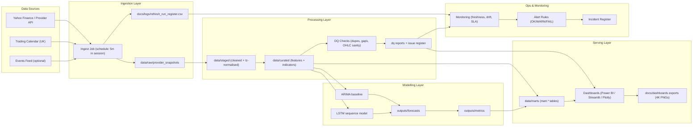
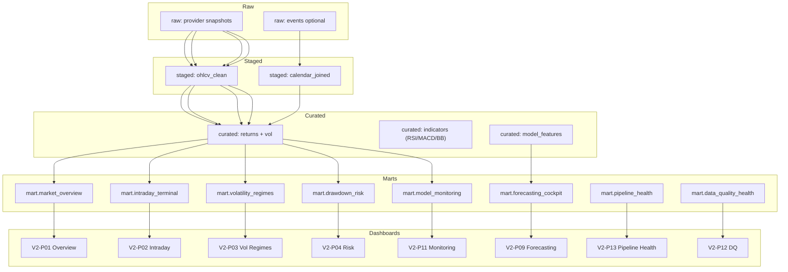
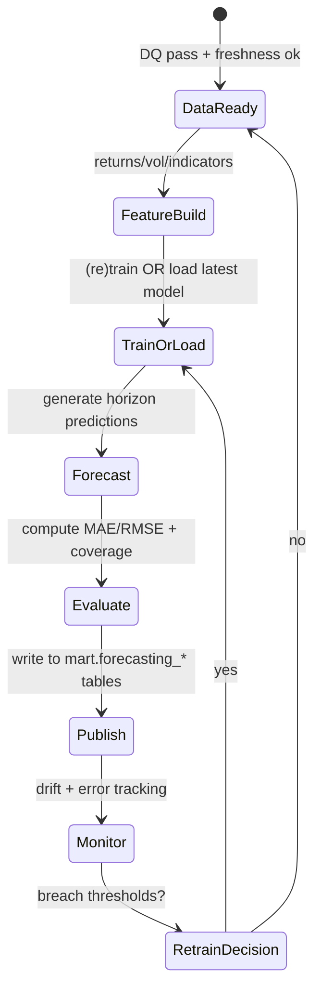
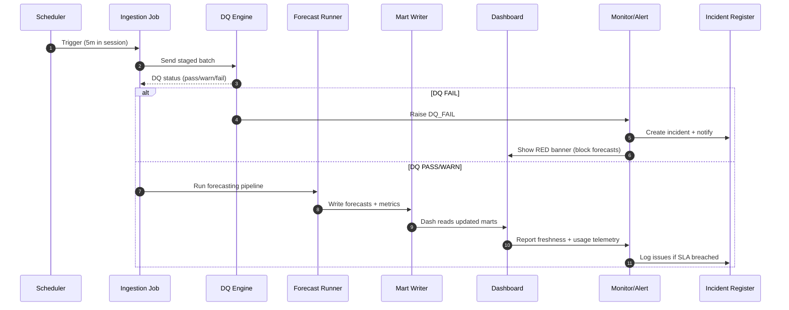

# FTSE-100-Financial-Analysis 🇬🇧📈
**Master’s Project Portfolio Repo (UK-themed, dashboard-first).**

This repository is built as a flagship portfolio project for **FTSE 100 financial market analysis**.
It is delivered in two tracks:

- **V1 — Dissertation Baseline (Replay / Snapshot):** faithful replication of a dissertation-style workflow (intraday visuals + ARIMA + LSTM; 10-minute horizon).
- **V2 — Modernised UK Market Terminal (Platform / Monitoring):** a production-style redesign with **medallion tables**, **monitoring**, and **premium neon dashboards**.

> **Not financial advice.** This repo is for analytics / reporting / modelling demonstration only.

---

## What you get (outputs)

### V1 (7 dashboard pages)
Exports are generated to `docs/dashboards/V1/exports/`:
1. Market overview
2. Candles + volume
3. Moving averages
4. ARIMA forecast (10-min)
5. LSTM forecast (10-min)
6. Model comparison
7. Data quality snapshot

### V2 (22 dashboard pages)
Exports are generated to `docs/dashboards/V2/exports/`:
- Overview, intraday terminal, volatility regimes, drawdown
- Correlation heatmap, sector rotation, top movers
- Technical indicators, forecasting cockpit, backtesting report
- Monitoring: model drift, DQ coverage, pipeline health, latency SLA
- Governance: KPI dictionary, measure catalogue, data inventory, lineage
- Operations: incident timeline, release notes

---

## Quickstart

### 1) Create environment
```bash
python -m venv .venv
source .venv/bin/activate
pip install -r requirements.txt
```

### 2) Build V1 (data → models → exports)
```bash
python scripts/v1_build_all.py
```

### 3) Build V2 (platform tables → monitoring → neon exports)
```bash
python scripts/v2_build_all.py
```


---

## Terminal realism: constituents + events enrichment

To make the V2 experience feel like a **UK market terminal**, the repo ships **reference datasets**
under `data/reference/` and uses them during `scripts/v2_build_all.py`:

- **FTSE 100 constituents universe** (tickers + sectors + weights): `data/reference/ftse100_constituents_universe_snapshot.csv`
- **UK macro calendar (stub)**: `data/reference/uk_macro_calendar_stub.csv`
- **Earnings calendar (stub, top-25)**: `data/reference/ftse100_earnings_calendar_stub_top25.csv`
- **Market news headlines (stub)**: `data/reference/market_news_headlines_stub.csv`

The build produces a unified table:

- `v2_modernisation_realtime/data/gold/events_calendar.(parquet|csv)`

You can control the universe source in V2:

```bash
# Offline-first (default)
python scripts/v2_build_all.py --constituents-source snapshot --weights-method snapshot

# Best-effort refresh from Wikipedia (requires internet + lxml/bs4)
python scripts/v2_build_all.py --constituents-source wikipedia --weights-method equal

# Include the stub headline feed inside the events calendar
python scripts/v2_build_all.py --include-news
```

> **Important:** weights and calendars here are designed for **portfolio realism** (demo/teaching),
> not as official FTSE Russell index weights or an authoritative economic calendar.


---

## Optional: Live pulls (Yahoo/Stooq/AlphaVantage/Polygon) + caching

The repo is **offline-first** (ships with cached snapshots) so it runs anywhere.
If you want the “real-time” feel, you can enable live pulls and cache them.

See: `DATA_PROVIDERS.md`

Example (V1, Yahoo intraday):

```bash
python scripts/v1_build_all.py --data-source yahoo --symbol "^FTSE" --cache-dir ./data_cache
```

Example (V2, Stooq daily anchor → synthetic intraday bridge):

```bash
python scripts/v2_build_all.py --data-source stooq --symbol "^UKX" --cache-dir ./data_cache
```

---

## Repo layout

```
FTSE-100-Financial-Analysis/
  v1_dissertation_baseline/
    data/raw/                  # cached raw snapshot
    data/processed/            # cleaned parquet snapshot
    outputs/figures/           # figures referenced by specs
    outputs/forecasts/         # ARIMA + LSTM forecast CSVs
    outputs/metrics/           # KPI + model metrics
    logs/                      # JSONL build logs
    notebooks/                 # V1 walkthrough notebooks

  v2_modernisation_realtime/
    data/bronze|silver|gold/   # platform tables (parquet)
    monitoring/reports/        # dq/drift/ops reports
    db/                        # duckdb placeholder
    outputs/                   # V2 analysis artifacts
    logs/                      # JSONL build logs
    notebooks/                 # V2 walkthrough notebooks

  docs/
    dashboards/                # page specs + exports for V1 + V2
    dissertation/              # dissertation document (V1 reference)
    mermaid/                   # architecture + lineage diagrams
    logs/                      # issue registers / ops docs

  src/ftse100/                 # reusable python package
  scripts/                     # build runners (V1 + V2)
```

---

## Architecture diagrams (Mermaid)

### End-to-end architecture (V2)



### Data lineage (medallion)



### Forecasting lifecycle



### Monitoring + alerts (sequence)



---

## Notes on data
- This repo ships with **offline synthetic snapshots** so everything runs deterministically in portfolio environments.
- The synthetic FTSE session is constrained to match a real daily OHLC print (see V1 metadata JSON) so results look credible.
- Hooks for live refresh can be added outside this sandbox (Yahoo/Stooq/paid data providers).

---

## License
MIT (see `LICENSE`).
## What's new in V2.2

This repo version adds **portfolio-grade governance realism** and a **Power BI export evidence pack**:

- **Governance logs (root):** `LOGBOOK.md`, `PROGRESS_LOG_DAILY.md`, `RISK_LOG.md`
- **Time tracking (root):** `WEEKLY_HOURS.csv`, `HOURS_BREAKDOWN.csv`
- **Deep registers:** `docs/logs/DECISIONS_LOG.md`, `ASSUMPTIONS_LOG.md`, `issue_register.csv`, `model_experiment_log.csv`, `dashboard_review_log.md`
- **V1 documentation packs:** `v1_dissertation_baseline/docs/diagrams/` and `v1_dissertation_baseline/docs/Dashboards/`
- **Power BI export pack (4K):** `v2_modernisation_realtime/bi_powerbi/exports/` (includes donut/pie + gauge visuals)

Key review docs:
- `docs/00_REPO_NAVIGATION.md`
- `docs/01_PORTFOLIO_WALKTHROUGH.md`

---

## What's new in V2.1

This repo version adds **terminal realism** and removes dangling spec references:

- **Curated `mart.*` layer** (`v2_modernisation_realtime/data/mart/`) — every V2 dashboard page now has a physical input table.
- **Populated DuckDB warehouse** (`v2_modernisation_realtime/db/warehouse.duckdb`) with `bronze.*`, `silver.*`, `gold.*`, and `mart.*`.
- **Repo-wide run register** (`docs/logs/refresh_run_register.csv`) for auditability.
- **4K dashboard exports** (all `docs/dashboards/**/exports/*.png` are 3840×2160).
- **UK market terminal app** (optional): `streamlit run apps/uk_market_terminal.py`.

